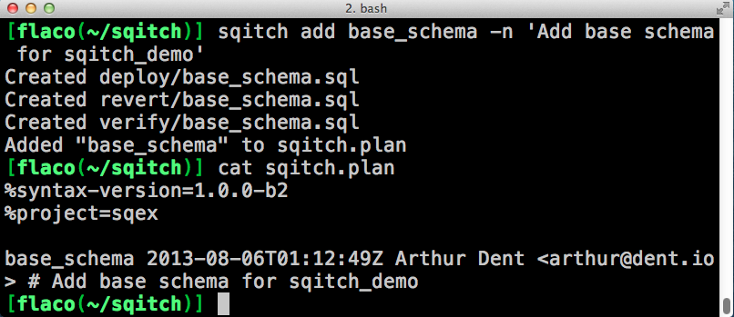

!SLIDE subsection

<h1>sqitch</h1>
<h2>sane database change management</h2>

!SLIDE bullets incremental transition=toss
# What is sqitch?

* Standalone change management system
* Native SQL
* sqitch + git + change

!SLIDE

# Why not migrations?

* they use an incomplete language
* numbered scipts are hard to track
* application specific (what happens when you need a function for 2 apps)

!SLIDE bullets incremental transition=toss
# sqitch philosophy

* no opinions
* native scripting
* cross-project dependency resolution
* no numbering
* distribution bundling
* future: VCS integration

.notes independent on ORM. changes can deoend on other changes. names not numbers.
.notes vcs integration will eventually interface with your vcs to create a plan
!SLIDE bullets incremental transition=toss
# sqitch philosophy

* reduced duplication
* built-in conifguration
* iterative development
* deployment planning
* git-style interface

!SLIDE bullets incremental transition=wipe
# sqitch terms

* change
* tag
* state
* plan
* add
* deploy

.notes change: unit of change in the db
.notes tag: think tag (alias for a single change)
.notes state: current state of db relative the plane
.notes plan: plan of deployment (order of changes with dependencies)

!SLIDE bullets incremental transition=wipe
# sqitch terms

* revert
* rebase
* rework
* verify
* committer
* planner

!SLIDE center
# get started

create a git repo

!SLIDE center
# get started

init sqitch

!SLIDE center
# sqitch configuration defaults

!SLIDE center
# configuration

Tell sqitch who you are:

    $ sqitch config --user user.name '*'
    $ sqitch config --user user.email '*'

The --user flag will make changes to ~/.sqitch/sqitch.conf

!SLIDE

# first change

sqitch add changename -n note

!SLIDE command
# deploy/base\_schema.sql

    @@@ sql
    -- Deploy base_schema for sqitch_example
    BEGIN;

      CREATE SCHEMA sqex;

    COMMIT;

!SLIDE command
# revert/base\_schema.sql

    @@@ sql
    -- Revert base_schema for sqitch_example
    BEGIN;

      DROP SCHEMA sqex;

    COMMIT;

!SLIDE command
# verify/base\_schema.sql

    @@@ sql
    -- Verify base_schema for sqitch_example
    BEGIN;

      SELECT pg_catalog.has_schema_privilege(
        'sqex', 'usage'
      );

    COMMIT;

!SLIDE center
# first sqitch deploy

The first deploy will also create the sqitch schema and the associated meta-data tables that track sqitch activity. 

!SLIDE center
# verification
You can verify on the actual database as shown below, but you don't have to. That's the beauty of the verify script.

!SLIDE center
# revert and new config settings

!SLIDE center
# sqitch status

In this case all changes have been deployed:

!SLIDE center
#sqitch log

only showing the last 3 changes. The log can also be filtered by event, committer, date, and change name.

!SLIDE center smaller
#sqitch metadata

Sqitch also records events in it's own set of metadata tables:

