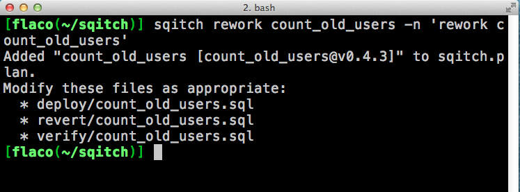
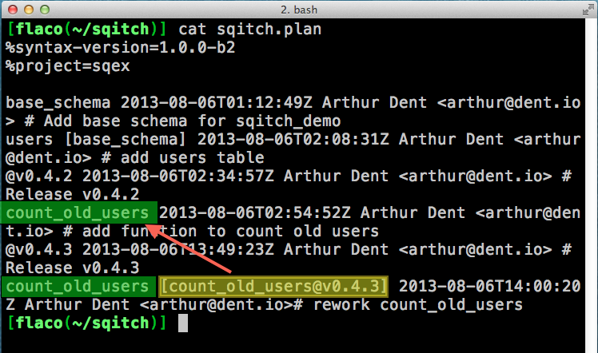
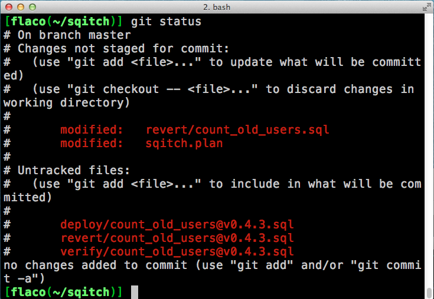
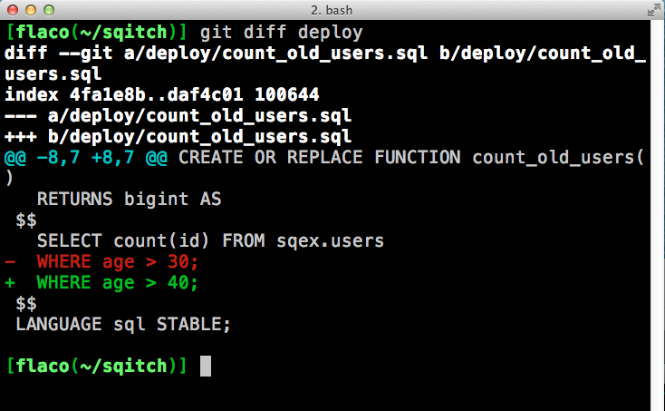

!SLIDE center
# Change with dependency

Create a new table users that depends on the base\_schema change.

!SLIDE command
# deploy/users.sql

    @@@ sql
    -- Deploy users
    -- requires: base_schema

    BEGIN;

    CREATE TABLE sqex.users(
      id serial,
      name text,
      admin boolean,
      age integer
    );

    COMMIT;

!SLIDE command
# verify/users.sql

    @@@ sql
    -- Verify users

    BEGIN;

    SELECT id, name, admin, age
    FROM sqex.users where false;

    ROLLBACK;

!SLIDE center
# Status with undeployed change

!SLIDE incremental
# Fun with revert and deploy

* sqitch revert @HEAD^ will revert one previous change
* sqitch deploy --taget will deploy up to the given target
* sqitch deploy --log-only will log the changes as deployed in the sqitch schema but will not actually execute any DDL.

!SLIDE incremental
# Some words of caution

* sqitch revert can be dangerous.
* Always run sqitch revert with a target
* Be very careful with reverts, reworks, or rebases that involve tables that contain data!

!SLIDE incremental
# Ship that Sqitch

* tag it: `sqitch tag v0.4.2 -n 'Release v0.4.2`
* bag it: `git commit -am 'tagging database Release v0.4.2`
* This is also a good time to tag the git repo because someday the VCS integration will hopefully keep the tags in sync.
* bundle it: `sqitch bundle v0.4.2`

!SLIDE center
# Let's add a function

In the real world you would also be writing a pgTAP function in parallel.

!SLIDE command
# deploy/count\_old\_users.sql

    @@@ sql
    -- Deploy count_old_users

    BEGIN;

    CREATE OR REPLACE FUNCTION sqex.count_old_users()
      RETURNS bigint AS
    $$
      SELECT count(id) FROM sqex.users
      WHERE age > 30;
    $$
    LANGUAGE sql STABLE;

    COMMIT;

!SLIDE command
# verify/count\_old\_users.sql

    @@@ sql
    -- Verify count_old_users

    BEGIN;

    SELECT has_function_privilege(
      'sqex.count_old_users()', 'execute'
    );

    ROLLBACK;

!SLIDE center

# and deploy the new function

!SLIDE incremental

# tag, tag, push.

* `sqitch tag v0.4.3 -n 'Release v0.4.3'`
* `git commit -am 'tagging db release v0.4.3' && git push`
* sqitch -d sq\_prod deploy
* ...
* oh crap. someone changed the requirements and the function needs to change.

!SLIDE incremental
# (re)work it

Rework is the command for altering an existing database change. It is best used in certain cases:

* when there you deployed to production and can not revert, modify, and re-deploy. Once the change has been released to production you **must not** modify the change script.
* when the changes are <a href="https://en.wikipedia.org/wiki/Idempotence">idempotent</a>.
* a tag has to be applied so that sqitch can disambiguate the changes. 

!SLIDE
# (re)work it

To quote the perldoc from sqitch:
  
"In effect, reworking a change is similar to adding one. However, rather
than writing new files for the change, the "rework" command copies the
files for the existing change. The new files are named with the tag
that comes between the changes, and serves as the file for the original
change. This leaves you free to edit the existing files."

!SLIDE incremental
# idempotent?

* a change that can be applied multiple times without changing the result.
* create or replace function statements are idempotent
* insert statements not so much

!SLIDE center
# rework

!SLIDE center

# rework plan

!SLIDE center

# reworked files

!SLIDE incremental
# reworked files

* Rework renames the original files with the last tag. `count_old_users.sql > count_old_users@v0.4.3.sql`
* The original deploy is copied to the new revert and the new deploy
* The original verify is copied to the new verify

!SLIDE command
# deploy/count\_old\_users

    @@@ sql
    -- Deploy count_old_users, reworked

    BEGIN;

    SET search_path=sqex,public;

    CREATE OR REPLACE FUNCTION count_old_users()
      RETURNS bigint AS
    $$
      SELECT count(id) FROM sqex.users
      WHERE age > 40;
    $$
    LANGUAGE sql STABLE;

    COMMIT;

!SLIDE center

!SLIDE 
# verify/count\_old\_users

    @@@ sql
    -- Verify count_old_users

    BEGIN;

    SELECT has_function_privilege(
      'sqex.count_old_users()', 'execute');

    SELECT 1/COUNT(*)
    FROM pg_catalog.pg_proc
    WHERE proname = 'count_old_users'
    AND pg_get_functiondef(oid)
      LIKE $$%WHERE age > 40%$$;

    ROLLBACK;

!SLIDE incremental
# deploy and commit the rework!

* `sqitch deploy`
* `git add .`
* `git commit -am 'update count_old_users age conditional'`

!SLIDE incremental
# Rework Review

* A tag must exist in order to rework a previous change.
* Your changes should be idempotent. (ie, don't rework a create table statement)
* The new revert file is the old deploy. This is to preserve state of the original change.

